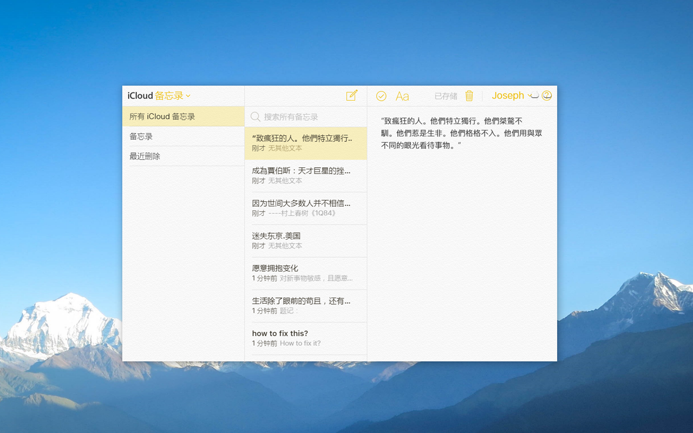
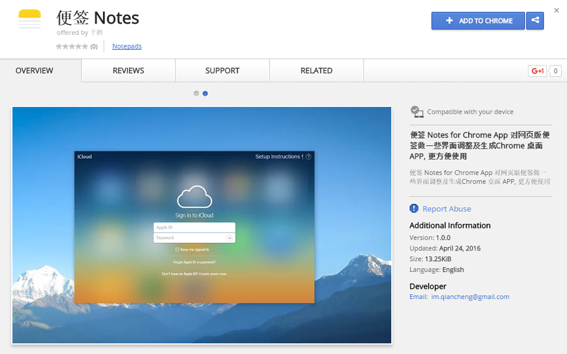

# iCloud-Notes-app
便签 Chrome App 对网页版苹果便签做一些界面调整及生成Chrome 桌面 APP, 更方便使用
**应用场景**：你平时会喜欢用苹果手机的便签Notes。喜欢随手记下一些灵感。并且会在手机或者Mac上查看。但是在公司，在学校，在别人的windows，linux上，但是朋友跟你发一些重要的文字，比如地址，邮箱，号码等。却只能通过聊天软件IM发来发去。你也不想在web页面总是登录iCloud，现在可以用这个chrome app来记录便签，瞬间就同步到了苹果设备。

#Preview

#Download
[Chrome Web Store][store] | [本地下载][releasesdownload1]

[store]: https://chrome.google.com/webstore/detail/%E4%BE%BF%E7%AD%BE-notes/lfaipgohagcbmfjhfokjdhcfcpfjonmg?utm_source=chrome-ntp-icon
[releasesdownload1]: https://github.com/iqiancheng/iCloud-Notes-app/releases/download/1.0.0/Notes_v1.0.0.crx

